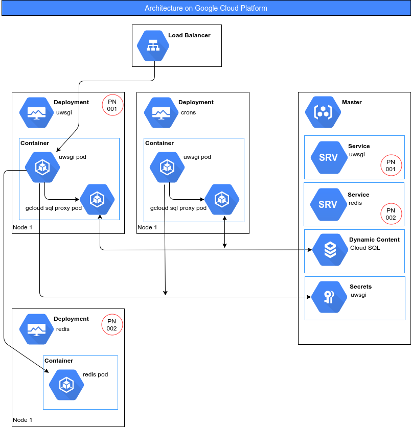

# Packing deployment with Helm charts.

First of all you need to install the `Helm` client following the next instructions:

```bash
curl https://raw.githubusercontent.com/kubernetes/helm/master/scripts/get > get_helm.sh
chmod 700 get_helm.sh
./get_helm.sh
```

For deploys is also needed the server portion of Helm, `Tiller` (it talks to a remote Kubernetes cluster). 
To install it into the cluster, simply runs:

```bash
helm init
```

For more information take a look at: [Install Helm](https://docs.helm.sh/using_helm/#installing-helm)

## Structure of repository

This repo contains a set of `charts` to make easy all deploys on Kubernetes.

```ignore
kubernetes-charts/    
├── packages/                           # Reult folder where construct temporaly packages before be installed.
|                                       # IMPORTANT: No commit packages into.
├── images/                             # Contains documentation images
├── django/                             # Contains the configuration for a django app deployment.
|    ├── .helmignore                    # List of patterns to ignore when build the package.
|    ├── Chart.yaml                     # A YAML file containing information about the chart.
|    ├── requirements.yaml              # List of required charts and their overriden configuration.
|    ├── values.yaml                    # The default configuration values for this chart
|    ├── charts/                        # Include all dependency packages
|    |                                  # IMPORTANT: No commit packages into.
|    └── templates/                     # A directory of templates that, when combined with values.
|        └── _helpers.tpl               # Difinition of template variables.
|                                       # Note that not require templates because this chart only encapsulate
|                                       # dependencies.
├── varnish/                            # Contains the configuration for a varnish deployment.
|    ├── .helmignore                    # List of patterns to ignore when build the package.
|    ├── Chart.yaml                     # A YAML file containing information about the chart.
|    ├── values.yaml                    # The default configuration values for this chart
|    └── templates/                     # A directory of templates that, when combined with values.
|        ├── _helpers.tpl               # Difinition of template variables.
|        ├── deployment.yaml            # Structure of deployment for this chart.
|        └── service.yaml               # Structure of service for this chart.
├── uwsgi/                              # Contains the configuration for a uwsgi deployment.
|    ├── charts/                        # Folder that contains built packages for the dependecies of this chart.
|    |                                  # IMPORTANT: No commit packages into, will be auto-generated.
|    ├── .helmignore                    # List of patterns to ignore when build the package.
|    ├── Chart.yaml                     # A YAML file containing information about the chart.
|    ├── requirements.yaml              # List of required charts and their overriden configuration.
|    ├── values.yaml                    # The default configuration values for this chart
|    └── templates/                     # A directory of templates that, when combined with values.
|        ├── NOTES.txt                  # A plain text file containing short usage notes (rendered with Go Template engine)
|        ├── _helpers.tpl               # Difinition of template variables.
|        ├── deployment.yaml            # Structure of deployment for this chart.
|        ├── secrets.yaml               # Base secrets for the chart.
|        └── service.yaml               # Structure of service for this chart.
├── .gitignore                          # Git configuration.
└── README.md                           # This documentation.
```

Take a look to [The Chart File Structure](https://github.com/kubernetes/helm/blob/master/docs/charts.md) to get
acquainted to chart structure.

The `uwsgi` chart is a generic Helm chart for deploy a `Django` application with a simple architecture:



## How to do to deploy a chart over Kubernetes?

This section explains how to deploy a Django app using using the `uwsgi` chart.
The example application is **_Mallorca Hiking_**.

1. First of all you need to update chart dependencies.

```bash
helm dependency update
```

This action will download the required packages (specified in `requirements.yaml`) into `packages/` directory.

2. Upon time you has updated dependencies, is time to build package from this Helm chart `uwsgi`.

```bash
helm package -u -d DESTINATION_PATH CHART_PATH
```

* *-u* &rarr; Allows you skip first step. It update dependencies.
* *-d DESTINATION_PATH* &rarr; Store the resultant package into specified path.
* *CHART_PATH* &rarr; The chart path you want to use for the deploy.

```bash
helm package -u -d packages uwsgi
```

3. Deploy the Django application.

```bash
helm install PACKAGE --namespace NAMESPACE --name RELEASE_NAME -f VALUES
```

* *PACKAGE* &rarr; The path to stored package.
* *--namespace NAMESPACE* &rarr; The namespace that will be create on _Google Cloud Platform_ and will be user with in
 the deployment.
* *--name RELEASE_NAME* &rarr; It must has a different value to _namespace_. It is used in the deployment and
 dependencies deployments.
* *-f VALUES* &rarr; Path to the file where are all values that overrides the Helm chart, for example `SECRET_KEY` or `DATABASE_PASSWORD`, etc.

```bash
helm install packages/uwsgi-0.1.0.tgz --namespace mallorcahiking --name r.mallorcahiking -f apps/mallorcahiking.yaml
```

## Develop new Helm charts

There are some notes and some command line instructions that can be useful as a guide how to develop new charts.

To create a new chart:

```bash
helm create CHART
```

* *CART* &rarr; Full path to destination chart.

```bash
helm create kubernetes-charts/uwsgi
```

After develop your template chart, you can validate if your chart is valid running a **lint**.

```bash
helm lint
```

##### HELM TEMPLATE

Helm Template is a plugin used to render the resultant deployment of your chart.

1. Install:

```bash
helm plugin install https://github.com/technosophos/helm-template
```

2. Usage:

```bash
helm template -n NAMESPACE -r RELEASE_NAME -f VALUES --notes CHART > output.yaml
```

* *-n NAMESPACE* &rarr; The namespace used with in deployment.
* *-r RELEASE_NAME* &rarr; The release name used with in deployment.
* *-f VALUES* &rarr; Override specific values for application.
* *--notes* &rarr; Render the _NOTES.txt_ file chart's dependencies notes.
* *CHART* &rarr; Location path to the chart.

```bash
helm template -n mallorcahiking -r r.mallorcahiking -f apps/mallorcahiking.yaml --notes . > ~/Desktop/deployment.yaml
```

An important command line utility is list your repositories to manage your chart dependencies.

* List

```bash
helm repo list
```

* Add

```bash
helm repo add NAME URL
```

example:

```bash
helm repo add incubator https://kubernetes-charts-incubator.storage.googleapis.com/
```

## References

* Helm charts
    * [https://github.com/kubernetes/helm/blob/master/docs/charts.md](https://github.com/kubernetes/helm/blob/master/docs/charts.md)
    * [https://docs.helm.sh/](https://docs.helm.sh/)
    * [https://daemonza.github.io/2017/02/20/using-helm-to-deploy-to-kubernetes/](https://daemonza.github.io/2017/02/20/using-helm-to-deploy-to-kubernetes/)

* Helm plugin
    * Templates [https://github.com/technosophos/helm-template](https://github.com/technosophos/helm-template)
    * Chartify [https://github.com/appscode/chartify](https://github.com/appscode/chartify)

* Helm *redis* stable chart
    * [https://github.com/kubernetes/charts/tree/master/stable/redis](https://github.com/kubernetes/charts/tree/master/stable/redis)

* Monocular
    * [https://github.com/kubernetes-helm/monocular](https://github.com/kubernetes-helm/monocular)


## Use case:

* **App for use case**: django app called _mallorcahiking_
* **Requirements**: redis, varnish, crons

1. Serve built local packages:

```bash
cd packages
helm serve
```

2. Build packages and with all dependencies:

```bash
helm package -u -d packages varnish
helm package -u -d packages uwsgi
helm package -u -d packages nginx
```

```bash
helm package -u -d packages django-nginx-uwsgi
```

3. Test to show resultant _yaml_ for deployment:

```bash
helm install packages/django-0.1.0.tgz --dry-run --debug --namespace mallorca-hiking --name mallorcahiking -f apps/mallorca-hiking/mallorcahiking.yaml > ./output.yaml
```

4. Install:

```bash
kubectl --namespace=mallorca-hiking create secret generic cloudsql-oauth-credentials --from-file=cloudsql-authorization.json=apps/mallorca-hiking/cloudsql-authorization.json
helm install packages/django-0.1.0.tgz --namespace mallorca-hiking --name mallorcahiking -f apps/mallorca-hiking/mallorcahiking.yaml
```

# The Chart Repository Guide

We deploy server on [Google Cloud Storage](https://github.com/kubernetes/helm/blob/master/docs/chart_repository.md)


# COMMON MISTAKES OR ERRORS

#### Error: transport is closing

* Cause

```bash
IN:
helm status

OUT:
Error: transport is closing
```

* Detection and fix

```bash
IN:
kubectl -n kube-system get pod

OUT:
NAME                                                READY     STATUS             RESTARTS   AGE
heapster-v1.3.0-3440173064-wv0jw                    2/2       Running            8          23d
kube-dns-2782919792-7cs3r                           3/3       Running            12         13d
kube-dns-autoscaler-2501648610-0ljr4                1/1       Running            4          23d
kube-proxy-gke-kc3-pre-default-pool-b6b81d03-wpn9   1/1       Running            4          10d
kubernetes-dashboard-490794276-dlqjd                1/1       Running            4          23d
l7-default-backend-3574702981-gf41z                 1/1       Running            4          23d
tiller-deploy-3703072393-0hqz0                      0/1       CrashLoopBackOff   6          23d
```

**tiller-deploy-3703072393-0hqz0** is CrashLoopBackOff

```bash
IN:
kubectl -n kube-system delete pod tiller-deploy-3703072393-0hqz0
```

#### Error: chart CHART matching VERSION not found in local index

* Cause

```bash
IN:
helm install --namespace palladium --name weddings -f apps/palladium/weddings.yaml local/django-uwsgi --debug --dry-run

OUT:
[debug] Created tunnel using local port: '39947'

[debug] SERVER: "localhost:39947"

[debug] Original chart version: "0.1.1"
Error: chart "django-uwsgi" matching 0.1.1 not found in local index. (try 'helm repo update'). No chart version found for django-uwsgi-0.1.1
```

* Detection and fix

```bash
cd ~/kubernetes-charts/packages
helm serve

cd ~/kubernetes-charts/
./update
```

Update index of your server repo (use case: localhost)