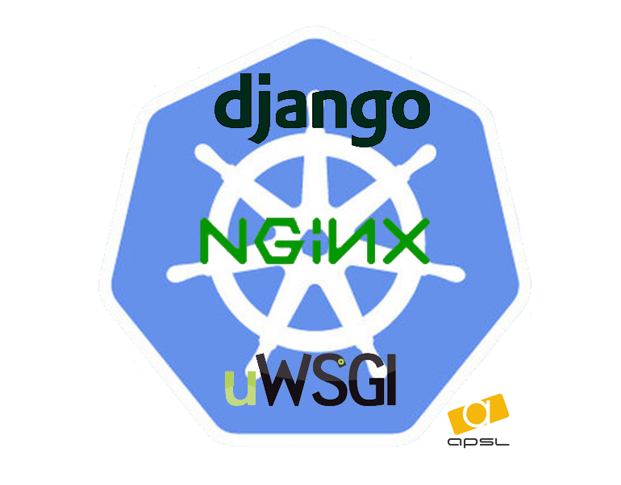
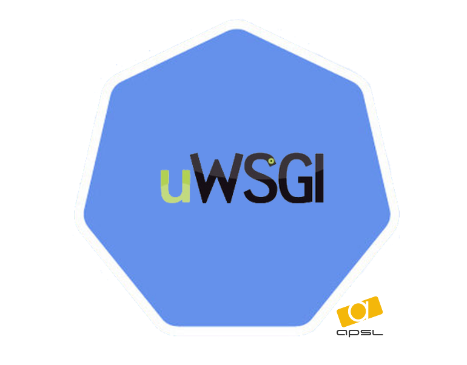

# Overview

Use this repository to submit Charts for Helm. All of them are used into
APSL organitzation to deploy our Django applications over GKE.


   
  


# Dependencies


## Helm & Tiller

First of all you need to install the `Helm` client following the next
instructions:

```bash
curl https://raw.githubusercontent.com/kubernetes/helm/master/scripts/get > get_helm.sh
chmod 700 get_helm.sh
./get_helm.sh
```

For deploys is also needed the server portion of Helm, `Tiller` (it
talks to a remote Kubernetes cluster).
To install it into the cluster, simply runs:

```bash
helm init
```

For more information take a look at:
[Install Helm](https://docs.helm.sh/using_helm/#installing-helm)


## Packages

To use this repository as a k8s charts repository for deploy your apps
you have to configure helm adding it:

```bash
helm repo add apsl https://raw.githubusercontent.com/APSL/kubernetes-charts/master/packages/
```

Check that it has been added.

```bash
helm repo list

NAME     	URL
stable   	https://kubernetes-charts.storage.googleapis.com
incubator	https://kubernetes-charts-incubator.storage.googleapis.com/
local    	http://127.0.0.1:8879/charts
apsl     	https://raw.githubusercontent.com/APSL/kubernetes-charts/master/packages/

```


# Structure of repository

```ignore
kubernetes-charts/    
├── packages/                           # Reult folder where construct temporaly packages before be installed.
|    ...
|    ├── index.yaml                     # Contains the configuration for a django app deployment.
|    ├── django-nginx-uwsgi-0.1.1.tgz   # Django package. It includes nginx, uwsgi, redis, varnish packages.
|    ├── uwsgi-0.1.1.tgz                # Uwsgi package.
|    └── varnish-0.1.0.tgz              # Varnish package.
...
├── django/                             # Contains the configuration for a django app deployment.
|    ├── .helmignore                    # List of patterns to ignore when build the package.
|    ├── Chart.yaml                     # A YAML file containing information about the chart.
|    ├── requirements.yaml              # List of required charts and their overriden configuration.
|    ├── values.yaml                    # The default configuration values for this chart
|    ├── charts/                        # Include all dependency packages
|    |                                  # IMPORTANT: No commit packages into.
|    └── templates/                     # A directory of templates that, when combined with values.
|        └── _helpers.tpl               # Difinition of template variables.
|                                       # Note that not require templates because this chart only encapsulate
|                                       # dependencies.
...
└── uwsgi/                              # Contains the configuration for a uwsgi deployment.
     ├── charts/                        # Folder that contains built packages for the dependecies of this chart.
     |                                  # IMPORTANT: No commit packages into, will be auto-generated.
     ├── .helmignore                    # List of patterns to ignore when build the package.
     ├── Chart.yaml                     # A YAML file containing information about the chart.
     ├── requirements.yaml              # List of required charts and their overriden configuration.
     ├── values.yaml                    # The default configuration values for this chart
     └── templates/                     # A directory of templates that, when combined with values.
         ├── NOTES.txt                  # A plain text file containing short usage notes (rendered with Go Template engine)
         ├── _helpers.tpl               # Definition of template variables.
         ├── deployment.yaml            # Structure of deployment for this chart.
         ├── secrets.yaml               # Base secrets for the chart.
         └── service.yaml               # Structure of service for this chart.
```

Take a look to [The Chart File Structure](https://github.com/kubernetes/helm/blob/master/docs/charts.md) to get
acquainted to chart structure.


# How to

This section will try to explain you how to use this repository to
deploy your applications.


## How to deploy a chart over Kubernetes?

Will show you the procedure to deploy a Django application using this
charts.

This example we'll deploy an app called **_demo_**, suposing you satisfy
all dependencies.

1. Deploy the Django application.

```bash
helm install PACKAGE --version VERSION --namespace NAMESPACE --name RELEASE_NAME -f VALUES
```

* *PACKAGE* &rarr; The path to stored package.
* *VERSION* &rarr; The exact version of the package to install.
If it is not set the last version will be deployed.
* *NAMESPACE* &rarr; The namespace that will be create on
 _Google Cloud Platform_ and will be user with in the deployment.
* *RELEASE_NAME* &rarr; It must has a different value to
_namespace_. It is used in the deployment and dependencies deployments.
* *VALUES* &rarr; Path to the file where are all values that
overrides the Helm chart, for example `SECRET_KEY` or
`DATABASE_PASSWORD`, etc.

```bash
helm install apsl/django-nginx-uwsgi --version 0.1.1 --namespace demo --name r-demo -f your_demo_app_values.yaml
```


## How to test your deployment before apply it on your K8s cluster?

Helm Template is a plugin used to render the resultant deployment of
your chart.

1. Install:

```bash
helm plugin install https://github.com/technosophos/helm-template
```

2. Use it:

```bash
helm template -n NAMESPACE -r RELEASE_NAME -f VALUES --notes CHART > output.yaml
```

* *NAMESPACE* &rarr; The namespace used with in deployment.
* *RELEASE_NAME* &rarr; The release name used with in deployment.
* *VALUES* &rarr; Override specific values for application.
* *CHART* &rarr; Location path to the chart.

```bash
helm template -n demo -r r-demo -f your_demo_app_values.yaml --notes . > ~/k8s-deployment.yaml
```

## Structure example of data values

This section show you how structure the values to deploy a single
application using `django-nginx-uwsgi` chart.

```
# your_demo_app_values.yaml
global:
  image:
    uwsgi: eu.gcr.io/project/my-app-uwsgi
    nginx: eu.gcr.io/project/my-app-nginx

  dataConfigMap:
    - name: REDIS_HOST
      value: "10.0.0.1"
    - name: DEFAULT_FROM_EMAIL
      key: django.emailDefaultFromEmail
      value: Hotel Morito <bookmorito@hotelmorito.es>
    - name: AWS_STORAGE_BUCKET_NAME
      value: my-app-prod
    - name: AWS_ACCESS_KEY_ID
      value: aws-key-id

  dataSecrets:
    - name: AWS_SECRET_ACCESS_KEY
      value: secret-aws-access-ley

app:
  deployment:
    probes:
      livenessEnabled: true
      liveness:
        enabled: false

  replicaCount: 1

  strategy:
    rollingUpdate:
      maxSurge: 1
      maxUnavailable: 0
    type: RollingUpdate

  secrets:
    secretKey: django-secret-key-value
    passwordDB: django-passwd-db-value
    sentryDSN: sentry-dsn-value

  configMap:
    enableSentry: "True"
    databaseHost: 127.0.0.1
    databaseName: myappdb
    databasePort: "5432"
    databaseUser: usrmyapp
    enableBasicAuth: "False"
    enableHttpsRedirect: "True"
    enable3wRedirect: "True"

varnish:
  enabled: true

crons:
  enabled: false

redis:
  enabled: false

```

# Contributors


## Developing new Helm charts

There are some notes and some command line instructions that can be
useful as a guide how to develop new charts.

To create a new chart:

```bash
helm create CHART
```

* *CART* &rarr; Full path to destination chart.

```bash
helm create django-nginx-uwsgi
```

After develop your template chart, you can validate if your chart is valid running a **lint**.

```bash
helm lint django-nginx-uwsgi
```


## Building package

If you contribute creating new Charts or improving the existent you
should do this:

* Serve your packages locally
* Resolve repository dependencies (local repository)
* Update dependent locally repositories your Chart
* Generate your package
* Regenerate index-yaml

To simplify all this tasks, you only have to execute this:

```bash
make helm-up & \
make helm-packages && \
helm repo index packages
```

*NOTE:* Its possible see some non-liveness message using make command
to build packages. If the message is like _"No requirements found in
~/kubernetes-charts/nginx-uwsgi/charts"_ ignore it.
It is because the commnand script try to get dependencies of all
packages even if it has not _charts_ (the dependency folder).


### Use case:

We will generate a new chart **_packagedemo__**:

0. Create the chart
```bash
helm create packagedemo
```
1. Serve built local packages:
```bash
cd packages
helm serve
```
2. Build all dependent packages:
```bash
helm package -u -d packages uwsgi
helm package -u -d packages nginx
helm package -u -d packages packagedemo
```
or use the Makefile commands:
```bash
make helm-packages
```
3. Generate index
```bash
helm repo index packages
```
or use the Makefile commands:
```bash
make helm-index
```
4. Test to show resultant _yaml_ for deployment:
```bash
helm template packages/packagedemo-0.0.1.tgz -n demo -r r-demo -f your_demo_app_values.yaml --notes . > ~/k8s-deployment.yaml
```
